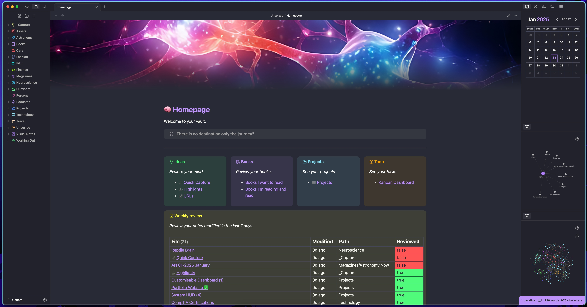

# 📝 Obsidian Setup 

# Theme
The theme I am using can be found in the `themes` folder. It is originally the dracula theme but modified a lot by me.

# Plugins
The plugins I use are:
- **Banners** (Display a banner at the top of the page)
- **Calendar** (Calendar widget in sidebar)
- **Dataview** (To create a table of my modified files in the past 7 days)
- **Iconize** (To give folders and files icons)
- **Kanban** (To create and view my overall tasks)
- **Homepage** (To set a custom note as a homepage)

# Snippets
I use snippets heavily and a lot are needed to achieve the looks of my setup. They can be found in the `snippets` folder and they include descriptions of what they do.

# Homepage



- To make the page wider to fit more content in I applied the cssclass `wide` to it in the note properties. This uses the `wide.css` snippet.

- To achieve the look of the columns side by side I use the `MCL Multi Column` snippet. Then in the note I write:
```
> [!multi-column]
>
>> [!Ideas]
>>  *Explore your mind*
>> - [[Insert link here]]
>
>> [!Books]
>> *Review your books*
>> - [[Insert link here]]
>> 
>
>> [!Projects]
>> *See your projects* 
>> - [[Insert link here]]
>>
>
>> [!todo]+
>> *See your tasks*
>> - [[Insert link here]]
```

**Note:** If this isn't working check the MCL Multi Column docs and tweak it to make it work.

<hr>

- To achieve the look of the table that shows the modified files in the past 7 days, I use the **Dataview** plugin and the `table.css` snippet. 
-     In my files I have a property called reviewed, and I give it either two values true or false. If I modify a file I also change the reviewed property to false. At the end of the week after reviewing the note I change the property to true. The snippet changes the color of the table cell block depending on the value of the notes property. I then write: 

```
> [!Weekly Review]
> *Review your notes modified in the last 7 days*
> ```dataview
> TABLE  durationformat(date(now) - file.mtime, "d'd'") + " ago" AS "Modified" , file.folder AS "Path", choice(reviewed = "true", "<span class='cellTrue'>true</span>", "<span class='cellFalse'>false</span>") AS "Reviewed"
> WHERE file.mtime >= (date(today) - dur(7 days))
> AND !contains(file.name, "Template")
> AND !contains(file.name, "Homepage")
> AND !contains(file.name, "Kanban")
> AND !contains(file.tags, "#toc")
> SORT file.mtime ASC
> ```
```
